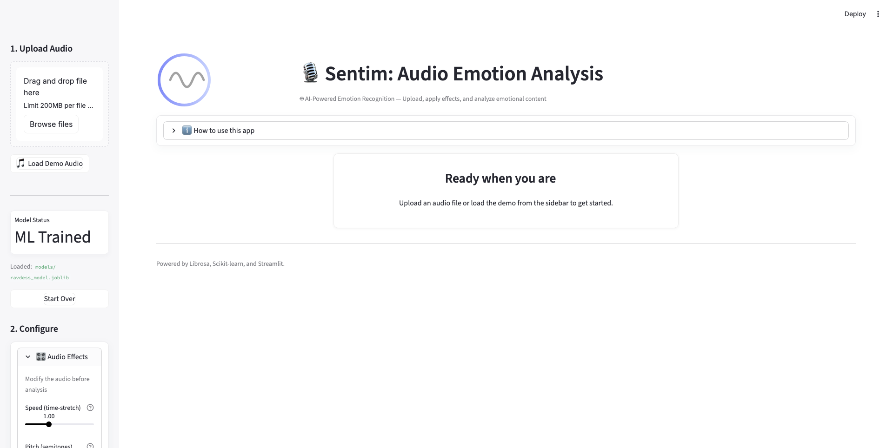

# Sentim — AI-Powered Audio Emotion Analysis

<div align="center">

[](https://www.python.org/)
[](https://streamlit.io/)
[](https://github.com/ilias-laoukili/Sentim/actions)
[](LICENSE)

**Analyze Audio Sentiment with Unparalleled Precision**

An interactive Streamlit application that combines advanced Digital Signal Processing (DSP) with machine learning to analyze and manipulate emotions in speech audio.

[Features](#features) • [Docker Quick Start](#-docker-quick-start-recommended) • [Local Setup](#-local-development-setup) • [Documentation](#documentation)



</div>

<div align="center">

[](https://pypi.org/project/librosa/) 
[](https://zenodo.org/records/6309729) 
[](https://pypi.org/project/scipy/) 
[](https://pypi.org/project/scikit-learn/) 
[](https://pypi.org/project/streamlit/)

</div>
---

## 🎯 Overview

Sentim is a hybrid audio analysis platform bridging **Digital Signal Processing (DSP)** and **Machine Learning (ML)**. It provides a robust pipeline for:
- **Emotion Recognition**: Classifying speech into 8 emotional categories using a Random Forest classifier trained on the RAVDESS dataset.
- **Acoustic Visualization**: Real-time rendering of spectrograms, waveforms, and extracted feature sets (MFCCs, Chroma, Tonnetz).
- **DSP Manipulation**: Modifying audio prosody via pitch shifting, time stretching, and spectral effects.
- **Emotion Synthesis**: Transforming the emotional tone of speech while preserving linguistic content.

The system uses a Random Forest classifier trained on the RAVDESS dataset, achieving robust performance across 8 emotion categories: neutral, calm, happy, sad, angry, fearful, disgust, and surprised.

---

## ✨ Features

### 🎤 Emotion Recognition
- **Statistical Feature Extraction**: MFCCs, Mel spectrograms, chroma, tonnetz, spectral features
- **Machine Learning Classification**: Random Forest with 200+ estimators and grid search optimization
- **High Accuracy**: Trained on 1,440 RAVDESS audio samples with stratified validation
- **Heuristic Fallback**: Rule-based emotion detection when ML model is unavailable

### 🎚️ Audio Processing
- **Phase Vocoder Time Stretching**: Speed up or slow down audio without changing pitch
- **Pitch Shifting**: Transpose pitch by semitones while preserving duration
- **Robotization**: Ring modulation effects for creative sound design
- **Real-time Processing**: Efficient algorithms with Streamlit caching

### 🎨 Emotion Synthesis
- **Prosody Manipulation**: Modify pitch, tempo, and energy to convey target emotions
- **Emotion Transformation**: Convert audio from one emotion to another
- **Formant Preservation**: Maintain voice quality during transformations
- **Interactive Controls**: Fine-tune emotional parameters in real-time

### 📊 Visualization
- **Spectrograms**: Time-frequency analysis with customizable colormaps
- **Feature Displays**: Visualize RMS energy, spectral centroid, pitch statistics
- **Confidence Scores**: Probabilistic predictions for all emotion classes
- **Side-by-side Comparison**: Before/after analysis for transformed audio

---

## 🐳 Docker Quick Start (Recommended)

The easiest way to run Sentim is via Docker, which handles all dependencies (including FFmpeg) automatically.

### Prerequisites
- **Docker Desktop** installed and running.

### Run the App
1. **Clone the repository**
   ```bash
   git clone https://github.com/ilias-laoukili/Sentim.git
   cd Sentim
   ```

2. **Launch with Docker Compose**
   ```bash
   docker-compose up --build
   ```

The application will be available at `http://localhost:8501`.

---

## 🛠 Local Development Setup

If you prefer running the application locally for development:

### Prerequisites
- **Python 3.9+**
- **FFmpeg** (Required for MP3/M4A processing)
  - **macOS**: `brew install ffmpeg`
  - **Ubuntu**: `sudo apt install ffmpeg`
  - **Windows**: [Download FFmpeg](https://ffmpeg.org/download.html) and add it to your System PATH.

### Installation

1. **Create and activate virtual environment**
   ```bash
   # macOS/Linux
   python -m venv .venv
   source .venv/bin/activate

   # Windows PowerShell
   python -m venv .venv
   .\.venv\Scripts\Activate.ps1
   ```

2. **Install dependencies**
   ```bash
   pip install -r requirements.txt
   ```

3. **Run the application**
   ```bash
   streamlit run src/frontend/app.py
   ```

The app will open in your browser at `http://localhost:8501`.

---

## 📚 Documentation

### Sphinx docs

Build the API and module documentation locally:

```bash
pip install -r docs/requirements.txt
make -C docs html
open docs/_build/html/index.html
```

The Sphinx configuration at `docs/conf.py` autodiscovers modules from `src/` and renders both
reStructuredText and MyST Markdown sources.

### Project Structure

```
sentim-app/
├── config.yaml                      # Application configuration (feature flags, paths)
├── docker-compose.yml               # Multi-service container orchestration
├── Dockerfile                       # Image build instructions
├── pyproject.toml                   # Project metadata & dependency management
├── requirements.txt                 # Runtime Python dependencies
├── requirements-dev.txt             # Development & testing dependencies
├── README.md                        # Project documentation (this file)
├── QUICKSTART.md                    # Minimal startup instructions
├── LICENSE                          # MIT license
├── coverage.xml                     # Test coverage (XML)
├── htmlcov/                         # HTML coverage report output
├── assets/
│   └── images/                      # Screenshots & static image assets
├── models/
│   └── ravdess_model.joblib         # Pre-trained emotion classifier
├── data/
│   ├── README.md                    # Data usage notes
│   └── raw/
│       └── audio_speech_actors_01-24/ # RAVDESS dataset (not bundled)
├── notebooks/
│   └── DSP_Project_Report.ipynb     # Exploration / technical report notebook
├── report/
│   └── Signal_Processing___Project/ # LaTeX academic report sources
├── scripts/
│   ├── train_model.py               # Train emotion classifier
│   ├── generate_report_figures.py   # Figures for LaTeX report
│   └── generate_replication_figures.py # Figures for replication / documentation
├── src/
│   ├── backend/                     # Core processing modules
│   │   ├── audio_processor.py       # Audio I/O & format conversion
│   │   ├── dsp_utils.py             # DSP algorithms (stretch, pitch, robotize)
│   │   └── emotion_analysis.py      # Feature extraction & ML logic
│   └── frontend/                    # Streamlit user interface
│       ├── app.py                   # Application entrypoint
│       ├── ui_components.py         # UI sections & widgets
│       └── ui_styles.py             # Custom styling helpers
├── tests/
│   ├── test_emotion_analysis.py     # Unit tests for emotion pipeline
│   └── __init__.py
└── src/__init__.py                  # Package init
```

Key additions vs prior structure: `config.yaml` for configurable parameters, separate `requirements-dev.txt` for development tooling, test suite under `tests/`, LaTeX academic report under `report/`, coverage artifacts (`coverage.xml`, `htmlcov/`), and figure generation helper scripts.

### Training Your Own Model

If you want to train a custom model on the RAVDESS dataset:

1. **Download RAVDESS**
   - Visit [RAVDESS on Zenodo](https://zenodo.org/record/1188976)
   - Download the Audio-only files
   - Extract to `data/raw/audio_speech_actors_01-24/`

2. **Run training script**
   ```bash
   python scripts/train_model.py
   ```

   The script will:
   - Load 1,440 audio samples from 24 actors
   - Extract statistical features (MFCCs, mel, chroma, etc.)
   - Perform grid search for optimal hyperparameters
   - Train Random Forest classifier with cross-validation
   - Evaluate on 20% test set
   - Save model to `models/ravdess_model.joblib`

   **Expected output:**
   ```
   Loading data from: data/raw/audio_speech_actors_01-24
   Found 1440 audio files.
   Splitting data: 80% train, 20% test
   Initializing classifier with Grid Search enabled...
   Training model... This may take a few minutes.
   ...
   Accuracy: 85.42%
   Model saved successfully.
   ```

### Using the Application

#### 1. Upload & Analyze
- Click "Choose an audio file to analyze"
- Supported formats: WAV, MP3, M4A, OGG
- Click "🎯 Analyze Audio"
- View emotion prediction, confidence scores, and spectrogram

#### 2. Apply DSP Effects
- **Speed**: 0.5x (slow) to 2.0x (fast)
- **Pitch**: -12 to +12 semitones
- **Robotize**: 0 Hz (off) to 500 Hz carrier frequency
- Click "🎚️ Process Audio" to apply effects

#### 3. Transform Emotions
- Select target emotion from dropdown
- Click "✨ Transform to [Emotion]"
- Compare original vs. transformed audio
- View confidence score changes

### Technical Details

#### Feature Extraction
The system extracts **352 features** per audio sample:
- **MFCCs**: 40 coefficients + delta + delta-delta (120 features)
- **Mel Spectrogram**: 128 frequency bands (256 features)
- **Chroma**: 12 pitch classes (24 features)
- **Tonnetz**: 6 tonal centroids (12 features)
- **Spectral Contrast**: 7 frequency bands (14 features)
- **Prosody**: RMS energy, zero-crossing rate, centroid, rolloff (6 features)

#### DSP Algorithms
- **Time Stretch**: Phase vocoder with Hann windowing (2048 FFT)
- **Pitch Shift**: Combined time stretch + resampling approach
- **Robotization**: Ring modulation with complex exponential carrier
- **Formant Preservation**: Bandpass filtering (80 Hz - 8 kHz)

#### Model Architecture
- **Algorithm**: Random Forest Classifier
- **Estimators**: 200 trees (default), optimized via grid search
- **Class Weighting**: Balanced to handle class imbalance
- **Normalization**: StandardScaler on all features
- **Validation**: Stratified 80/20 train-test split

---

## 🔧 Troubleshooting

### Common Issues

**1. FFmpeg not found (Windows)**
If you see errors regarding MP3/M4A loading on Windows:
- Ensure FFmpeg is installed and added to your **System PATH**.
- **Solution**: Use the **Docker Quick Start** method to bypass system dependency issues entirely.

**2. Streamlit command not found**
- Ensure your virtual environment is activated (`source .venv/bin/activate`).
- Try running via python module: `python -m streamlit run src/frontend/app.py`.

**3. Model loading errors**
If the classifier fails to load:
```bash
# Delete the existing model and retrain
rm models/ravdess_model.joblib
python scripts/train_model.py
```

**4. Low prediction accuracy**
- The model is optimized for **speech**, not music.
- Ensure recordings are clear with minimal background noise.
- Audio duration should be between 1-5 seconds for optimal results.

---

## 📊 Dataset Citation

This project uses the **RAVDESS** dataset for emotion recognition training:

> Livingstone SR, Russo FA (2018). *The Ryerson Audio-Visual Database of Emotional Speech and Song (RAVDESS)*. PLoS ONE 13(5): e0196391. https://doi.org/10.1371/journal.pone.0196391

**Dataset Details:**
- 24 professional actors (12 male, 12 female)
- 8 emotions × 2 intensities × 2 statements
- 1,440 total audio samples
- License: CC BY-NC-SA 4.0

Download: [RAVDESS on Zenodo](https://zenodo.org/record/1188976)

---

## 🤝 Contributing

Contributions are welcome! Please feel free to submit a Pull Request. For major changes:

1. Fork the repository
2. Create a feature branch (`git checkout -b feature/AmazingFeature`)
3. Commit your changes (`git commit -m 'Add some AmazingFeature'`)
4. Push to the branch (`git push origin feature/AmazingFeature`)
5. Open a Pull Request

---

## 📝 License

This project is licensed under the MIT License - see the [LICENSE](LICENSE) file for details.

---

## 🙏 Acknowledgments

- **RAVDESS** dataset creators for providing high-quality emotional speech data
- **Librosa** developers for excellent audio processing tools
- **Streamlit** team for the intuitive web framework
- **scikit-learn** community for machine learning infrastructure

### Special Thanks

This project was developed as part of my studies at **ESIEE Paris**. I would like to express my sincere gratitude to:

- **[Olivier Français](https://www.linkedin.com/in/olivier-fran%C3%A7ais-171a5851/)** - Professor, Dean of the Faculty at ESIEE Paris, ESYCOM, UMR 9007 CNRS / Université Gustave Eiffel - For his invaluable guidance and expertise in Digital Signal Processing

- **[E. Veronica Belmega](http://sites.google.com/site/evbelmega)** - Professor in Computer Science and Telecommunication Systems, Université Gustave Eiffel (UGE), CNRS, LIGM - For her expert instruction and support

- **[Amadou Assoumane](https://www.linkedin.com/in/amadou-assoumane/)** - For his mentorship and support throughout this project

Their dedication to teaching and passion for signal processing have been instrumental in the development of this work.

---

## 📧 Contact

**Ilias Laoukili** - [@ilias-laoukili](https://github.com/ilias-laoukili)

Project Link: [https://github.com/ilias-laoukili/Sentim](https://github.com/ilias-laoukili/Sentim)

---

<div align="center">

**Built with ❤️ by Ilias Laoukili**

*Last Updated: November 27, 2025*

© 2025 Sentim — Ilias Laoukili. All Rights Reserved.

</div>
